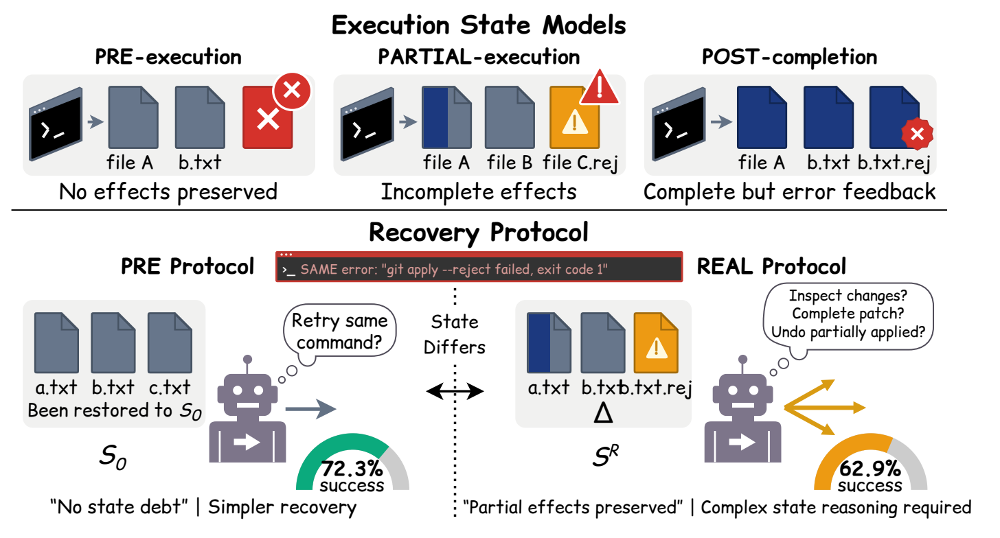

# AfterState: State-Faithful Evaluation of Coding-Agent Recovery

This repository contains the implementation for the paper:

> - AfterState: State-Faithful Evaluation of Coding-Agent Recovery.

## Overview

<p align="center">
  
</p>

AfterState evaluates coding-agent recovery at a failed-command boundary. PRE restores the state before command execution, while REAL preserves the state left by the failed command. Paired continuations share the task, command history, failure feedback, and recovery budget. UNDO and REINTRO remove and reconstruct the recorded state difference; WORKTREE and OUTSIDE partition its resources; POST represents completion under an eligible external-fault intervention. Final-state checks evaluate task completion and persistent-state obligations.

The implementation includes six controlled examples covering package installation, virtual environments, patch application, database migration, build caches, and multi-file generation. Recovery controllers include Native, Retry-1, Reflexion, Self-Refine, Inspect-1/3/6, and Read-3. Analysis scripts compute paired outcomes, repository-cluster bootstrap intervals, controller interactions, and held-out policy selection.

---

## Requirements

- Python >= 3.10
- Git, available on the system path
- pip, used for dependency installation and the local wheel example
- Matplotlib 3.10.6 and NumPy 1.26.4, used for figures
- pytest 7.4.0, used for tests

---

## Usage

### 1. Install Dependencies

Run from the repository root:

```bash
python -m pip install -r requirements.txt
```

### 2. Check Aggregate Data

Check the numerical relationships in the manuscript's reported counts and percentages:

```bash
python -m afterstate audit
```

The audit writes 82 check results to:

```text
reports/paper-audit.json
```

### 3. Generate Figures

Generate figures from the aggregate data in `data/paper/`:

```bash
python -m afterstate figures
```

The command produces PNG, SVG, and PDF files in `reports/figures/`. Open the HTML report at:

```text
reports/figures/index.html
```

Missing source values remain `null`. The generated report identifies the available Figure 9 values and the aggregate coverage view used alongside Figure 7(a).

### 4. Run the Controlled Examples

Execute the six fixture categories and certify their state transitions:

```bash
python -m afterstate demo --output runs/demo
```

Each fixture runs five mechanical repetitions and three reference-recovery repetitions. The state-condition evaluation produces 40 reference-repair continuations. Outputs are written to:

```text
runs/demo/certificates.json
runs/demo/demo-manifests.json
runs/demo/demo-runs.jsonl
runs/demo/summary.json
```

These continuations use reference repairs and make no model calls.

### 5. Run Paired Controller Evaluation

Run a scripted completion-claim example on the patch and database fixtures:

```bash
python -m afterstate run --actions-file examples/claim-only.json --categories patch database --controllers Native Retry-1 Inspect-3 --repeats 1 --configuration scripted-claim-only --output runs/claim-check
```

Analyze the resulting paired records:

```bash
python -m afterstate analyze runs/claim-check/runs.jsonl --output runs/claim-check/analysis.json
```

For an external adapter, save its executable argument list in `adapter-command.json`:

```json
["python", "examples/stdio_adapter.py"]
```

Then run:

```bash
python -m afterstate run --adapter-command adapter-command.json --categories patch database --controllers Native Inspect-3 --configuration custom-adapter --output runs/custom
```

The included stdio adapter returns scripted actions. The request/response fields and model integration interface are described in [Adapters](docs/ADAPTERS.md).

### 6. Run Tests

```bash
python -m pytest -q
```

To execute the aggregate audit, figure generation, tests, and fixture demonstration together:

```bash
python scripts/reproduce.py
```

Use `--skip-demo` to omit fixture certification. Recorded local results are available in [Validation results](reports/VALIDATION.md).